# Online Food Delivery Website

As the name says it all, it a simple full stack project which is used for ordering food from your favourite restaurant. It is a user friendly and responsive website.

[Visit Now](https://online-food-frontend.onrender.com) 🚀

## 🖥️ Tech Stack

### Frontend:

### Backend:

## Features

- The project has two interface i.e. an user interface and an admin interface.
- At user-end he/she can order any food item and set the quantity as per there requirement.
- At user-end he/she can also view there profile details and order history.
- At admins-end he/she can perform three tasks:
    - Add new food to the food menu.
    - Remove food items from the food menu.
    - View and change the status of order of  the customers
- Use JsonWebToken(JWT) for user login and register.

## NPM Packages I Used :
- react-router-dom
- axios
- react-toastify
- react-icons
- bcrypt (for encrypting the user password)
- body-parser
- dotenv (for environmental variables)
- jsonwebtoken (for user secure authentication)
- multer (for uploading and handeling backend images)
- nodemon (for auto-restart the backend server)
- validator (for form validation)

## Screenshots
Here are some of the Screenshots of online food delivery website

1.Landing Page

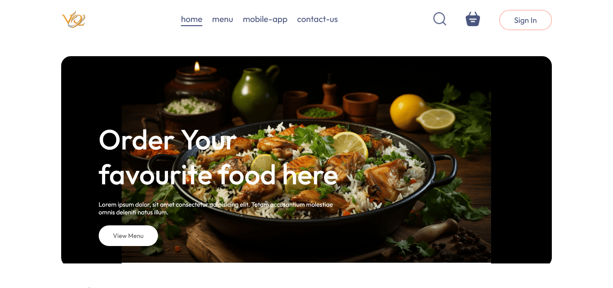

2.Menu Section

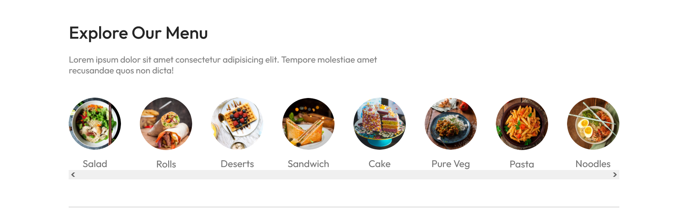
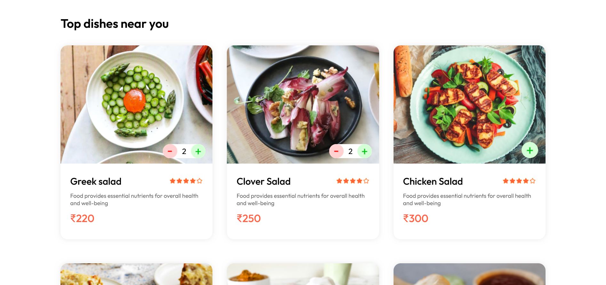

3.Signup popup

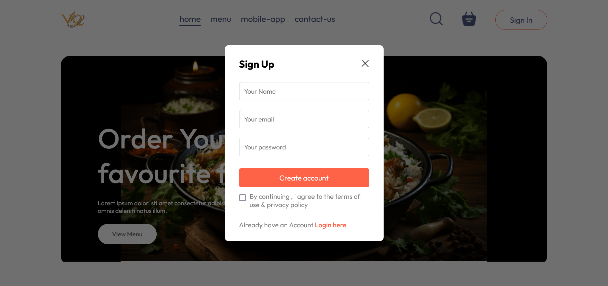

4.Login popup

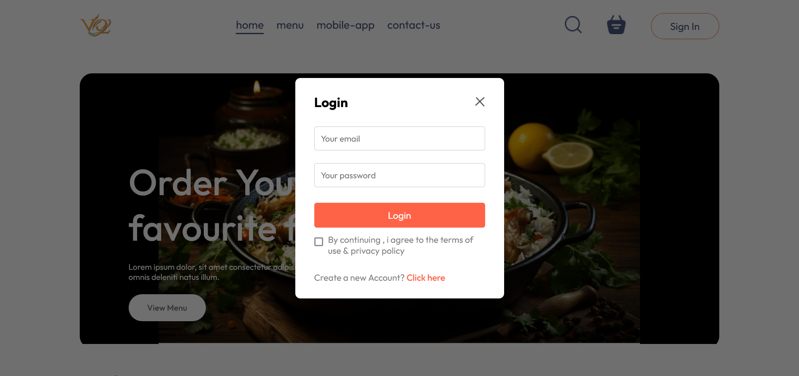

5.Cart Page

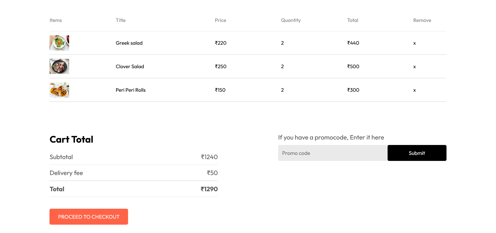

6.Address Page

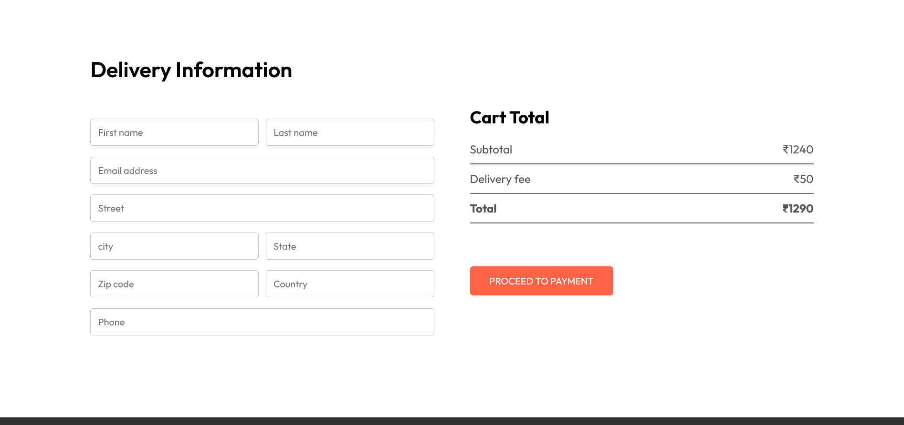

5.MY Orders Page

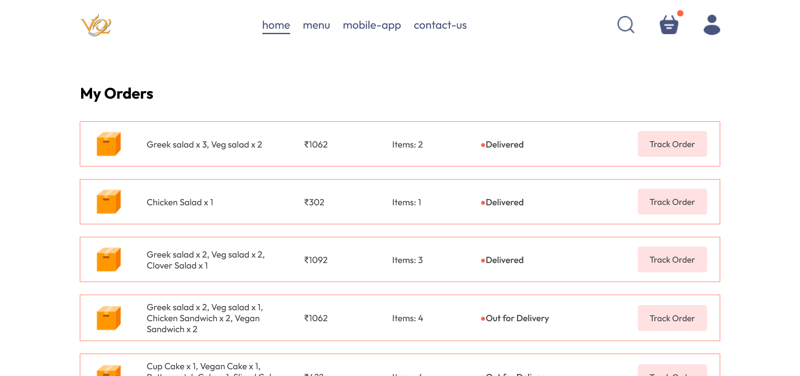

Website Link - https://online-food-frontend.onrender.com

Admin section:

6.Add Items Page

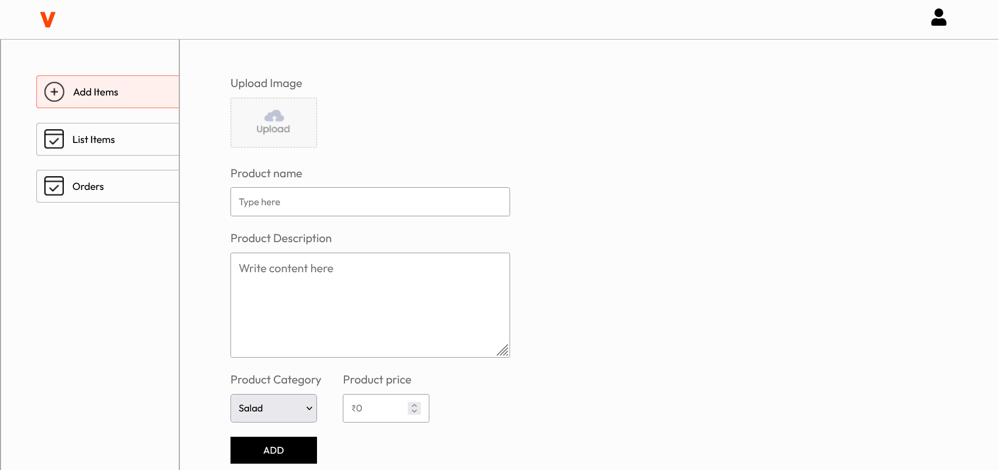

6.Items list Page

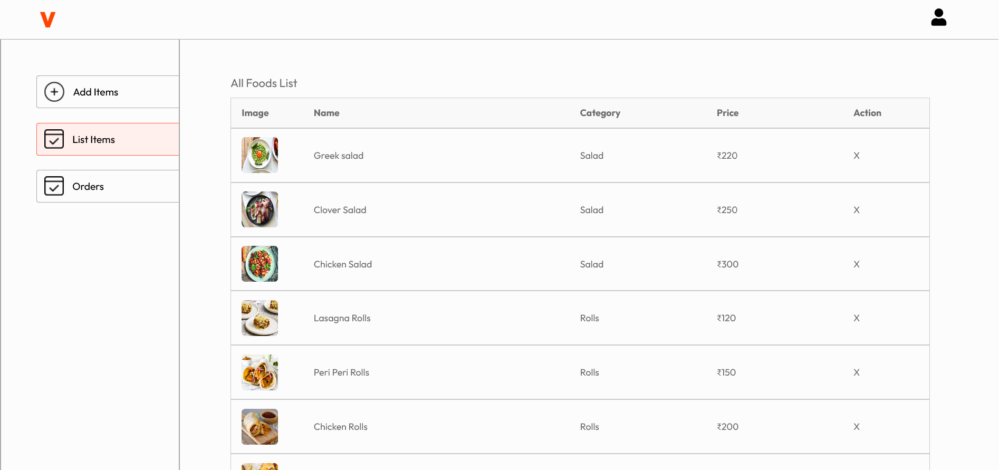

6.Orders Page

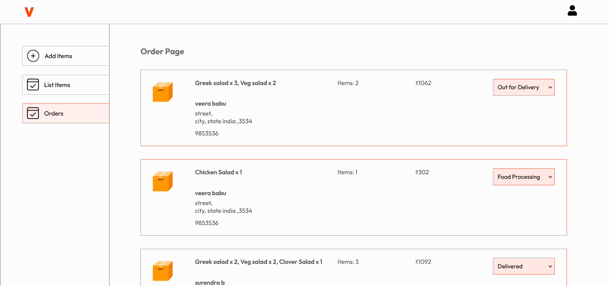

Admin Link - https://online-food-admin.onrender.com/add

